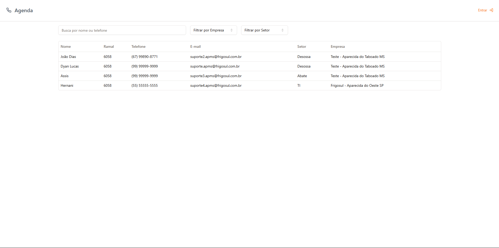
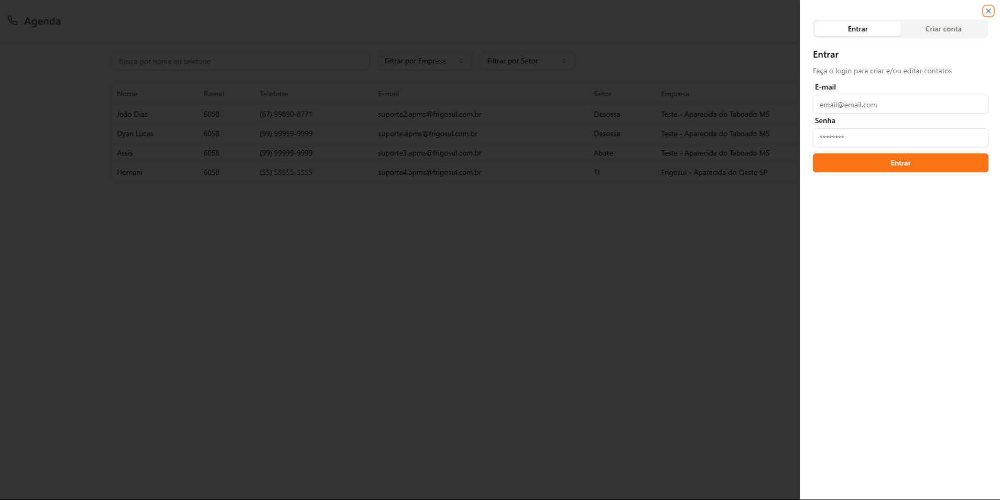
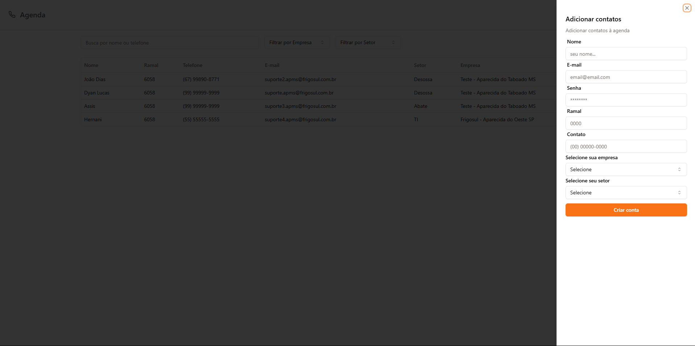
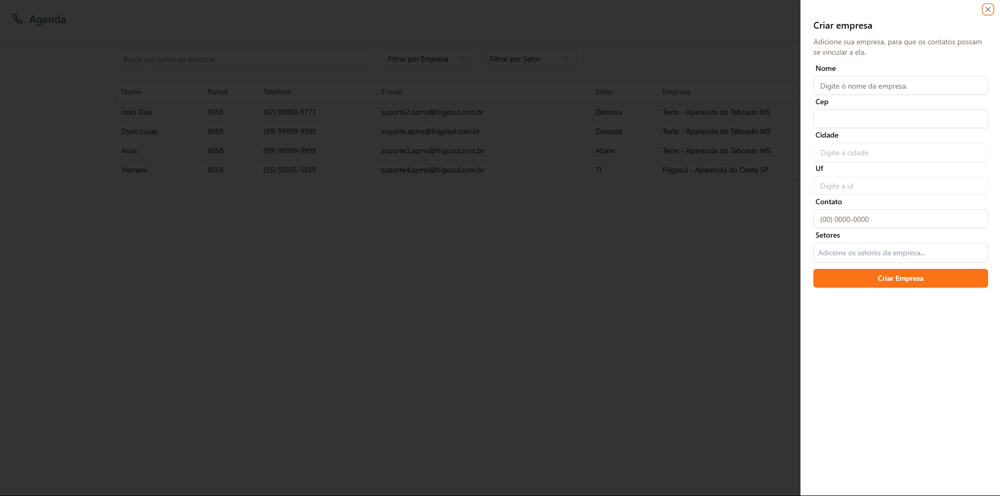

# Docs: Agenda Telefônica com Next.js

Este documento descreve a implementação da aplicação web agenda telefônica criada com Next.js.

---



## Tecnologias e Dependências Principais

- **Next.js**
- **TypeScript**
- **Prisma**
- **Tailwind CSS**
- **Radix UI**
- **React Hook Form**
- **Zod**
- **@tanstack/react-query**
- **Next Auth**
- **Fuse.js**
- **Sonner**
- **Docker Compose**

## Configuração Inicial

1. **Instalação de Dependências**:

   ```bash
   npm install
   ```

2. **Configuração do Banco de Dados**:

- Atualize o arquivo `.env` com as credenciais do banco de dados.
- Execute o docker-compose ou crie o banco de dados local:

  ```bash
  docker-compose up -d
  ```

- Execute as migrações:
  ```bash
  npx prisma migrate dev
  ```

3. **Execução do Ambiente de Desenvolvimento**:
   ```bash
   npm run dev
   ```

---

## Funcionalidades Principais

- **Cadastro de Contatos**: Adicione contatos na agenda.
- **Busca e Filtragem**: Pesquise contatos usando nome, email ou telefone.
- **Autenticação**: Login seguro com Next Auth e criptografia de senhas.
- **Interface Responsiva**: Construída com Shadcn UI e Tailwind CSS.
- **Notificações**: Feedback ao usuário usando Sonner.

---

## Páginas

<div class="display:block"> 
  <p class="display:block">Sign-in</p> 
  
</div>

<div class="display:block"> 
   <p class="display:block">Adicionar Contato</p> 
  
</div>

<div class="display:block">
    <p class="display:block">Adicionar Empresa</p> 
  
</div>

## Futuras Melhorias

- Suporte para exportação/importação de contatos em CSV.
- Implementação de testes automatizados para maior confiabilidade.
